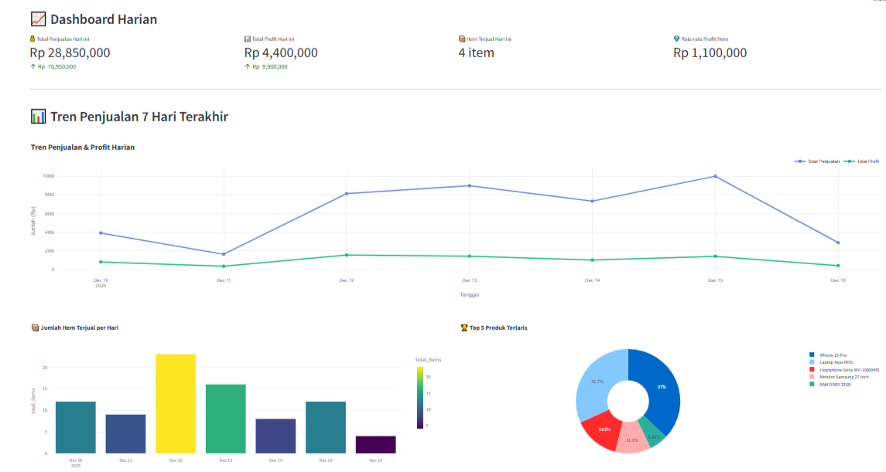
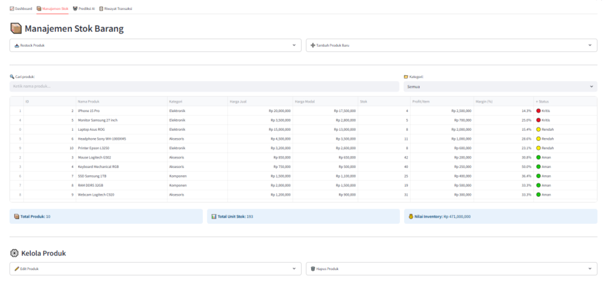
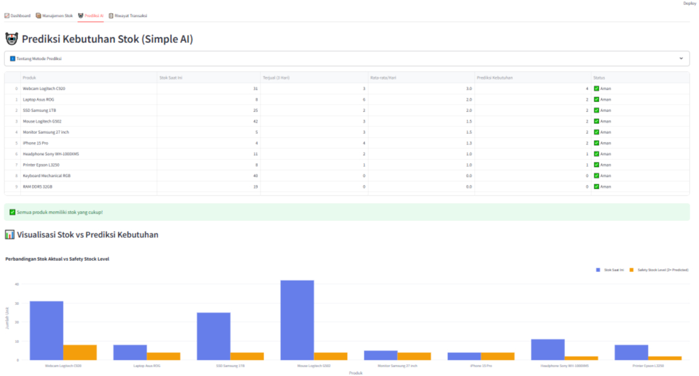
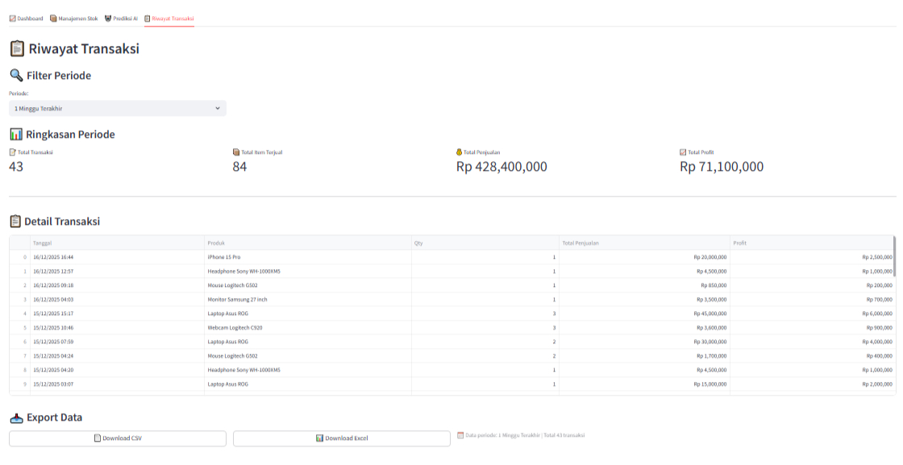

# 📊 Sales & Inventory Intelligence Dashboard


---

## 🎯 Elevator Pitch

**Sales & Inventory Intelligence Dashboard** adalah aplikasi web berbasis Python yang membantu **UMKM** (Usaha Mikro, Kecil, dan Menengah) untuk memantau penjualan, mengelola stok barang, dan memprediksi kebutuhan inventory secara **real-time**. Dibangun untuk menggantikan pencatatan manual ke spreadsheet, dashboard ini memberikan insight bisnis yang actionable dengan visualisasi data interaktif dan sistem alert otomatis untuk stok menipis.

---

## 📸 Demo & Screenshots

> **Dashboard Overview**



> **Stock Management**



> **AI Prediction**



> **Transaction History & Export**



---

## ✨ Key Features

### 📈 Real-time Dashboard
- **Metrics Card** - Total penjualan, profit, dan item terjual hari ini
- **Interactive Line Chart** - Tren penjualan & profit 7 hari terakhir
- **Pie Chart** - Top 5 produk terlaris
- **Delta Indicator** - Perbandingan dengan performa kemarin

### 📦 Inventory Management
- **CRUD Operations** - Tambah, edit, hapus, dan restock produk
- **Real-time Stock Tracking** - Update stok otomatis setelah transaksi
- **Category Filter** - Filter produk berdasarkan kategori
- **Search Functionality** - Cari produk dengan cepat

### 🚨 Low Stock Alert System
- **Visual Indicator** - Status stok dengan warna (🔴 Kritis, 🟡 Rendah, 🟢 Aman)
- **Threshold-based Alert** - Notifikasi otomatis jika stok ≤ 5 unit
- **Profit Margin Calculator** - Kalkulasi margin keuntungan per produk

### 🤖 Smart Prediction (Simple AI)
- **Moving Average Algorithm** - Prediksi kebutuhan stok berdasarkan rata-rata penjualan 3 hari
- **Safety Stock Recommendation** - Buffer 20% untuk antisipasi fluktuasi
- **Restock Alert** - Rekomendasi produk yang perlu di-restock

### 📋 Transaction History & Export
- **Flexible Date Filter** - Filter: 1 minggu, 1 bulan, 3 bulan, atau custom range
- **Summary Metrics** - Ringkasan total transaksi per periode
- **Export to CSV/Excel** - Download laporan untuk analisis lebih lanjut

---

## 🏗️ Business Logic & Architecture

```
┌─────────────────────────────────────────────────────────────────┐
│                        FRONTEND (Streamlit)                      │
│  ┌──────────┐ ┌──────────┐ ┌──────────┐ ┌──────────────────┐   │
│  │Dashboard │ │  Stock   │ │   AI     │ │    Transaction   │   │
│  │  Metrics │ │Management│ │Prediction│ │     History      │   │
│  └────┬─────┘ └────┬─────┘ └────┬─────┘ └────────┬─────────┘   │
└───────┼────────────┼────────────┼────────────────┼──────────────┘
        │            │            │                │
        ▼            ▼            ▼                ▼
┌─────────────────────────────────────────────────────────────────┐
│                    BACKEND LOGIC (Python)                        │
│  ┌────────────────────────────────────────────────────────────┐ │
│  │  database.py                                                │ │
│  │  - get_connection()      - add_product()                    │ │
│  │  - get_products()        - update_stock()                   │ │
│  │  - add_transaction()     - get_sales_prediction()           │ │
│  │  - restock_product()     - delete_product()                 │ │
│  └────────────────────────────────────────────────────────────┘ │
└─────────────────────────────────────────────────────────────────┘
        │
        ▼
┌─────────────────────────────────────────────────────────────────┐
│                      DATABASE (SQLite)                           │
│  ┌─────────────────┐         ┌─────────────────────────────┐   │
│  │    products     │         │       transactions          │   │
│  │  - id           │◄───────►│  - id                       │   │
│  │  - name         │   FK    │  - product_id               │   │
│  │  - category     │         │  - quantity                 │   │
│  │  - price/cost   │         │  - total_price/profit       │   │
│  │  - stock        │         │  - transaction_date         │   │
│  └─────────────────┘         └─────────────────────────────┘   │
└─────────────────────────────────────────────────────────────────┘
```

### Data Flow:
1. **User Input** → Sidebar form untuk input transaksi baru
2. **Backend Processing** → Validasi, kalkulasi profit, update stok
3. **Database Operations** → CRUD ke SQLite menggunakan parameterized queries
4. **Frontend Rendering** → Visualisasi dengan Plotly dan metrics real-time

---

## 🚀 Installation & Setup

### Prerequisites
- Python 3.10 or higher
- pip (Python package manager)
- Git

### Step-by-Step Installation

```bash
# 1. Clone the repository
git clone https://github.com/abdurrahmanap/sales-inventory-dashboard.git
cd sales-inventory-dashboard

# 2. Create virtual environment (recommended)
python -m venv venv

# 3. Activate virtual environment
# Windows:
venv\Scripts\activate
# macOS/Linux:
source venv/bin/activate

# 4. Install dependencies
pip install -r requirements.txt

# 5. Run the application
streamlit run app.py
```

### 🌐 Access the App
After running the command, open your browser and navigate to:
```
http://localhost:8501
```

> 💡 **Note:** On first run, the app will automatically generate 50 dummy transactions for demo purposes.

---

## 📁 Project Structure

```
sales-inventory-dashboard/
│
├── 📄 app.py                 # Main Streamlit application
├── 📄 database.py            # Database operations & CRUD functions
├── 📄 requirements.txt       # Python dependencies
├── 📄 README.md              # Project documentation (this file)
│
├── 📁 .streamlit/            # Streamlit configuration (optional)
│   └── config.toml
│
└── 📄 inventory.db           # SQLite database (auto-generated)
```

### Key Files Explained:

| File | Description |
|------|-------------|
| `app.py` | Main application file containing all Streamlit UI components, charts, and user interactions |
| `database.py` | Modular database layer with SQLite connection, table creation, and all CRUD operations |
| `requirements.txt` | List of Python packages needed to run the project |

---

## 🛠️ Tech Stack

| Technology | Purpose |
|------------|---------|
| **Python 3.10+** | Core programming language |
| **Streamlit** | Web application framework for data apps |
| **SQLite** | Lightweight relational database |
| **Pandas** | Data manipulation and analysis |
| **Plotly** | Interactive data visualization |
| **Openpyxl** | Excel file export functionality |

---

## 📈 Future Improvements

- [ ] User authentication & multi-user support
- [ ] More advanced ML prediction (ARIMA, Prophet)
- [ ] Cloud database integration (PostgreSQL, MySQL)
- [ ] REST API endpoints for mobile app integration
- [ ] Email notification for low stock alerts
- [ ] Dashboard customization & themes

---

## 🤝 Contributing

Contributions, issues, and feature requests are welcome! Feel free to check the [issues page](https://github.com/abdurrahmanap/sales-inventory-dashboard/issues).

---

## 📬 Contact

**[Abdurrahman AP]**

[](https://linkedin.com/in/abdurrahmanap)
[](mailto:abdurrahmanraka313@gmail.com)
[](https://github.com/abdurrahmanap)

---

## 📄 License

This project is licensed under the MIT License - see the [LICENSE](LICENSE) file for details.

---

<p align="center">
  Made with ❤️ using Python & Streamlit<br>
  <sub>Portfolio Project - 2025</sub>
</p>
